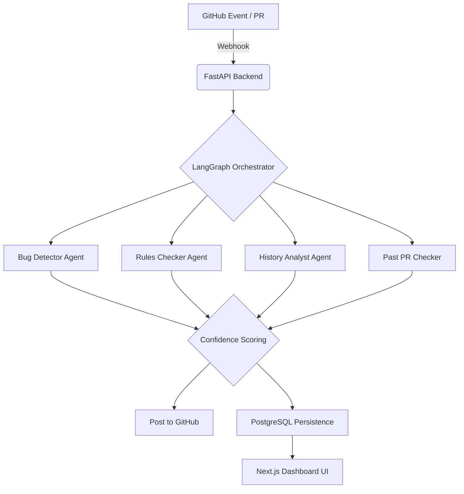

# 🌌 Antigravity AI: The Autonomous Code Auditor

[](https://langchain-ai.github.io/langgraph/)
[](https://fastapi.tiangolo.com/)
[](https://nextjs.org/)
[](https://www.postgresql.org/)

**Antigravity AI** is an advanced, production-grade autonomous code analysis ecosystem. It integrates multi-agent orchestration via **LangGraph** with local LLM intelligence (**Ollama / DeepSeek**) to provide a private, lightning-fast security and logic auditing layer for your development workflow.

---

## 🚀 The Proof of Concept (POC) Showreel

Use these scenarios for your presentation to showcase the full range of the system:

### 1. ⚡ Automatic PR "Zero-Touch" Audit
*   **The Scenario**: A developer pushes code to a GitHub PR.
*   **The Result**: Within seconds, the system verifies the HMAC signature, triggers a background analysis through an **ngrok** tunnel, and posts inline Markdown reviews directly to GitHub.
*   **Value**: Eliminates human wait time. The "Shift Left" dream realized.

### 2. 🛡️ The "Logic Trap" Detection
*   **The Scenario**: A PR introduces a subtle off-by-one error or a potential SQL injection that static analysis tools miss.
*   **The Result**: The **Bug Detector Agent** simulates the logic flow and flags the specific line with a high-severity warning and a suggested fix.
*   **Value**: Prevents critical production outages.

### 3. 🎯 Multi-Repository "Force Scan"
*   **The Scenario**: You need to audit an established external repository (e.g., `facebook/react`).
*   **The Result**: Using the **Dashboard Manual Trigger**, you simply enter the Repo URL and PR number. The system fetches the entire diff context and runs a complete audit on demand.
*   **Value**: Instant auditing for open-source dependencies or legacy code.

### 4. 🧠 Multi-Agent Collaborative Reasoning
*   **The Scenario**: Multiple agents (Rules, History, Bug) flag the same file.
*   **The Result**: The **Confidence Scoring Node** notices the consensus and boosts the report's priority, highlighting it as a "Critical Hotspot" on the Frontend Dashboard.
*   **Value**: Higher signal, lower noise compared to single-agent systems.

---

## 🛠️ System Architecture



### The Intelligence Agents
*   **Bug Detector**: Specialized in security flaws and edge-case logic.
*   **Rules Checker**: Enforces your team's unique architectural and style patterns.
*   **Git History Agent**: Analyzes churn and predicts reliability issues.
*   **Past PR Agent**: Remembers historical mistakes to prevent regressions.

---

## 💻 Tech Stack & Scalability

| Component | Technology | Why it matters |
|-------|-----------|----------------|
| **Orchestration** | LangGraph 0.2 | Complexity management & stateful agents |
| **Intelligence** | DeepSeek-Coder V2 | 87+ programming languages native support |
| **Backend** | FastAPI | High-speed, async Python performance |
| **Database** | PostgreSQL | Robust persistence for historical auditing |
| **Frontend** | Next.js 15 | Premium, responsive "Mission Control" UI |

---

## 🕹️ Quick Start & Setup

### 1. Clone & Launch
```bash
docker-compose up --build
```
*This starts the API, PostgreSQL, and the Ollama model server automatically.*

### 2. Set Environment
Edit the `.env` file with your `GITHUB_TOKEN` and `GITHUB_WEBHOOK_SECRET`.

### 3. Webhook Tunneling (For Webhooks)
Use **ngrok** to expose your local port 8000:
```bash
ngrok http 8000
```

### 4. Dashboard Mission Control
Open [http://localhost:3000](http://localhost:3000) to view real-time telemetry, reports, and trigger force scans.

---

## 🌟 Vision
**Antigravity AI** is not just a tool; it's a 24/7 guardian of code quality. It turns the "Pull Request" from a manual bottleneck into an autonomous security gate, ensuring that every line of code is audited by the collective intelligence of multiple specialized AI agents.

---
**Developed for the next generation of Software Engineering.**
